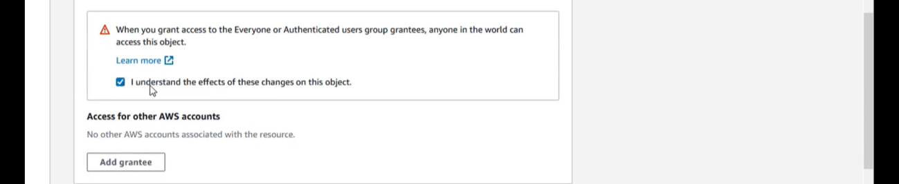

> <u>CLOUD CONCEPTS S3</u>
>
> (Simple Storage Service)
>
> • **Amazon** **S3** is a virtual storage service provided by Amazon,
> which can be accessed from anywhere at any time through internet
> access. Common examples of such types of storage are Dropbox, OneDrive
> and google drive (provide 15GB of free space for storage). Just as in
> google drive only software is stored or saved but it cannot be
> installed. Likewise, S3 is also object level storage.
>
> • **Max** **Storage** **of** **a** **bucket** **is** **5TB.** •
> **Types** **of** **Storage:**
>
> o Block Level Storage: Can be used as a storage device and allows the
> installation of software. E.g., Hard disk drive and in cloud context
> the default hard drive (30GB) attached to EC2 (windows server) is
> block level storage.
>
> o Object Level Storage: Do not provide operation level access
> (installation) only storage is provided.
>
> • Objects are stored in buckets. The bucket in cloud is same as folder
> and object could be any file type say media file, image, or any type
> of document. Buckets must not have the same names. Multiple objects
> can be stored in a bucket.
>
> ✓ Key has the folder, file name and the extension which is an object
> to be stored in a bucket.

• Say you are in the North Virginia Region with 6 availability zones
(physical data centers) and you want to store an object. Whenever you
store an object, it is spread amongst multiple AZ. Now, if you want to
delete any stored object, it won’t be deleted immediately because copies
of that object are in various AZs. First all the copies are deleted, and
the object is deleted. Same is the case with modification or updating an
object. This is **<u>an eventual consistency model</u>** in which any
operation performed on an object will take time as all the changes in an
object will be replicated amongst all the copies.

> o In context of Data Redundancy Model there are two types of models: ▪
> Eventual consistency model
>
> ▪ Read after write model. (Access the data as it is created e.g.,
> renaming of file in a bucket)

E & OE

*Handouts:* *Drakhshan* *Bokhat*

> ➢ The data is only shared in all the AZs of that region, but it will
> not be shared outside the region. This can be done and known as CORS
> (Cross origin resource sharing).
>
>  How cost can be minimized?  How data can be made secure?
>
> • S3 is designed for seamless scaling it will automatically handle
> high volume of requests. S3 can manage the data storage behind your
> bucket if data size exceeds 5TB and allows you to put more data.
>
> • Data can be accessed anywhere through Dashboard, Command Line
> Interface, or AWS SDK.

E & OE

*Handouts:* *Drakhshan* *Bokhat*

>  style="width:2.7775in;height:1.07585in" />• **S3** **Storage**
> **Classes:** There are 6 types of storage classes. o **<u>Standard
> Storage:</u>** This is the default storage in
>
> S3. The data kept in this storage can be accessed as soon as it is
> created. Since it makes data available immediately it costs a lot.
> Hence it is recommended to use this storage for testing purposes not
> as permanent storage.
>
> o **<u>Standard Infrequent Access:</u>** If data is to be accessed
> frequently this type of class is recommended. Say if you want to
> access the data once a week or once a month put the data in IA bucket.
> This way the cost for storage is minimized and you will be charged
> when you access the data.
>
> o **<u>One zone Infrequent Access:</u>** It is just like *Standard*
> *Infrequent* *Access,* but the difference is when data is stored in
> *Standard* *Storages,* they spread the data in all the zones in a
> region while in *one* *zone* *IA*, data is kept in one Availability
> Zone only. Problem with one zone IA is that in case of accidental
> deletion all the data is lost. Since there is no back up it is less
> recommended and has a very low cost.
>
> o **<u>Intelligent Tiering:</u>** It is an intelligent class which
> automatically moves the data to low-cost solutions. E.g., if stored
> data is not accessed for a long period of time, it will automatically
> move that data to the low-cost storage class. Main limitation for this
> feature is that file size must be equal to or greater than 120 KB.
>
> o **<u>Glacier:</u>** If the data is to be stored for long term and
> the access time is very low this class is recommended. In this class
> stored data cannot be accessed before 90 days (min). In case of an
> emergency access, a request must be generated before 3 – 5 hours. A
> new modification in this class allows <u>expedited retrieval
> access</u> which is charged.
>
> o **<u>Glacier Deep Archive:</u>** It is same as Glacier class, but
> the access time is 180days or 6 months (min). Data in this storage can
> also be accessed through expedited retrieval or access request.

E & OE

*Handouts:* *Drakhshan* *Bokhat*

>  If any class is not selected at the time of storage creation the
> default storage i.e., standard storage is created which can be changed
> later.
>
>  style="width:2.61583in;height:2.52083in" /> Versioning is enabled for
> backup not enabled by default. It is recommended for Disaster
> Recovery.  Other Applications:

E & OE

*Handouts:* *Drakhshan* *Bokhat*

> <u>DEMO</u>
>
>  style="width:3.03917in;height:1.33751in" /> style="width:1.15418in;height:0.53753in" /> style="width:1.15585in;height:0.53753in" /> style="width:1.15417in;height:0.53753in" /><u>(Lab creating a bucket
> with object and access it through browser.)</u>
>
> Create a bucket

Upload File Images

Access through Browser

> • Search for S3 or go through Services.
>
> • Dashboard for storage S3
>
> • AWS Market place

E & OE

*Handouts:* *Drakhshan* *Bokhat*

> • Create a bucket.
>
> • Enter the bucket name. Bucket name must be unique and can be as long
> as 63 characters (digit only, alphabets or alphanumeric can be used).
> There must not be a capital letter. As each object is accessed through
> a specific URL.
>
> • It is a global service that can be accessed from any region.
> *Region* *selection* *option* *is* *optional*.
>
> • Existing buckets can be used *(optional)*.

E & OE

*Handouts:* *Drakhshan* *Bokhat*

> • Public access option can be checked or unchecked.
>
> • Bucket Versioning is disabled by default and works as a backup. It
> is used to create different versions of a file. In case of accidental
> deletion, different versions of a file will be available.
>
> • Tagging (naming) can be done.

E & OE

*Handouts:* *Drakhshan* *Bokhat*

> • Default encryption is disabled. Can be enabled.
>
>  style="width:6.49764in;height:2.14375in" />• In advanced setings
> objects can be locked which disables the access of the object by any
> other. After that click on create bucket.
>
>  style="width:6.49764in;height:2.13958in" />• **Name** **error:** Name
> already exists it means that there exists a bucket around somewhere
> with same name though we do not have any bucket in our bucket list.
>
> ’

E & OE

*Handouts:* *Drakhshan* *Bokhat*

> • Change the name and create the new bucket.
>
> • To store the object, click on the bucket name.
>
> • See the properties tab to explore different configurations like
> tagging, intelligent tiering, static web hosting, encryption, bucket
> versioning, object locking etc.
>
> • In permission public access is managed and bucket level permissions.
>
> • Now click on object. You can add object directly or can place an
> object in a folder. Click on upload.

E & OE

*Handouts:* *Drakhshan* *Bokhat*

> • Click on files and upload any image file and file is added.
>
> • Destination is the bucket name.
>
>  style="width:6.49722in;height:2.38611in" /> style="width:6.49875in;height:0.57014in" />• Click on upload. File
> will be uploaded. Disturbing internet connection will result in
> unsuccessful upload or any other problem.

E & OE

*Handouts:* *Drakhshan* *Bokhat*

> • Click on file name.
>
> • Object is created with default setings.
>
> • Click on URL and open it in browser.
>
>  style="width:6.49653in;height:1.05486in" />• Access denied error is
> due to setings that public access of bucket is blocked. Change the
> setings by allowing public access and try again.
>
> Go-to permissions click on edit uncheck the option and click save
> changes.

E & OE

*Handouts:* *Drakhshan* *Bokhat*

> • And type confirm.
>
>  style="width:6.4975in;height:1.06319in" />• Next step is to make
> object publicly accessible. Click on object then click on Permissions
> and click on edit.

E & OE

*Handouts:* *Drakhshan* *Bokhat*

> • Check the options and save the changes and refresh the browser page
> to view the file.

E & OE

*Handouts:* *Drakhshan* *Bokhat*
